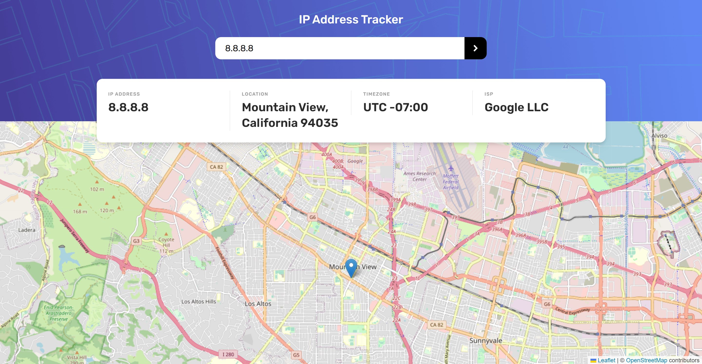

# Frontend Mentor - IP address tracker solution

This is a solution to the [IP address tracker challenge on Frontend Mentor](https://www.frontendmentor.io/challenges/ip-address-tracker-I8-0yYAH0). Frontend Mentor challenges help you improve your coding skills by building realistic projects. 

## Table of contents

- [Overview](#overview)
  - [The challenge](#the-challenge)
  - [Screenshot](#screenshot)
  - [Links](#links)
- [My process](#my-process)
  - [Built with](#built-with)
  - [What I learned](#what-i-learned)
  - [Useful resources](#useful-resources)
- [Author](#author)
- [Acknowledgments](#acknowledgments)

## Overview

### The challenge

Users should be able to:

- View the optimal layout for each page depending on their device's screen size
- See hover states for all interactive elements on the page
- See their own IP address on the map on the initial page load
- Search for any IP addresses or domains and see the key information and location

### Screenshot

### Links
- Solution URL: [Solution URL](https://www.frontendmentor.io/challenges/ip-address-tracker-I8-0yYAH0/hub/ip-address-tracker-with-react-typescript-tailwind-and-fetch-cNvmEhqzQa)
- Live Site URL: [Live Site URL](https://ip-address-tracker.justinfowlerart.com/)

## My process

### Built with

- [React](https://reactjs.org/) - JS library
- [TypeScript](https://www.typescriptlang.org/) - JS Superset
- [Tailwind CSS](https://tailwindcss.com/) - Styles
- [Ipify Geolocation API](https://geo.ipify.org/) - IP Address Lookup
- [LeafletJS](https://leafletjs.com/) - Interactive Map JS Library
- [OpenStreetMap](https://www.openstreetmap.org/) - Map Tile Data

### What I learned

I learned a ton about working with APIs, chaining API calls that depend on data from the previous call, and securing API keys. I also gained valuable experience working with interactive maps and map tiles.

### Useful resources

- [IP Geolocation API Docs](https://geo.ipify.org/docs) - Straightforward and easy documentation to begin making API calls quickly.
- [React Leaflet](https://react-leaflet.js.org/) - This made it much easier to work with Leaflet in a React component.

## Author

- Website - [Justin Fowler Art](https://www.justinfowlerart.com)